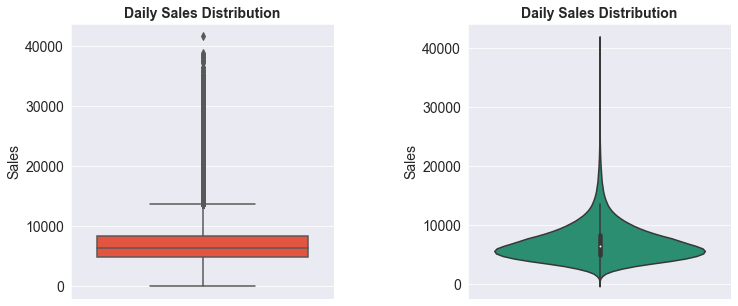
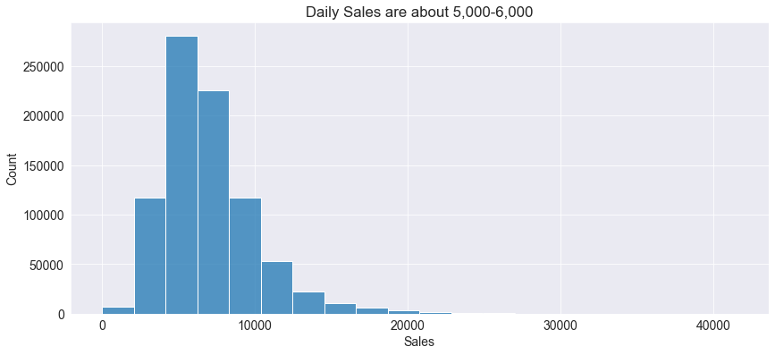
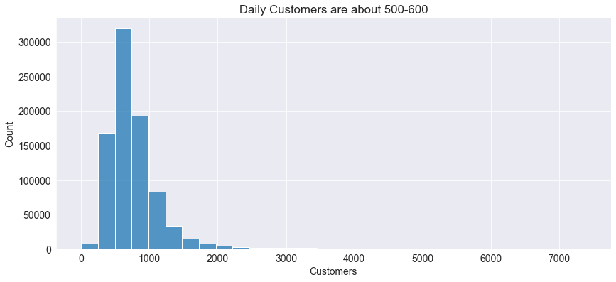
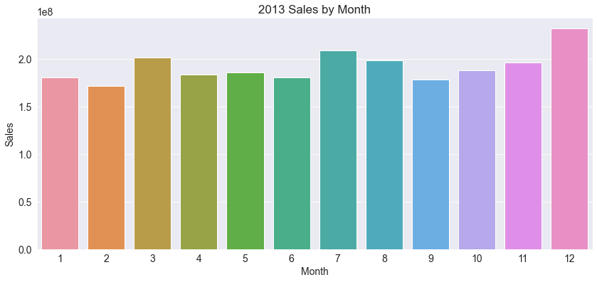
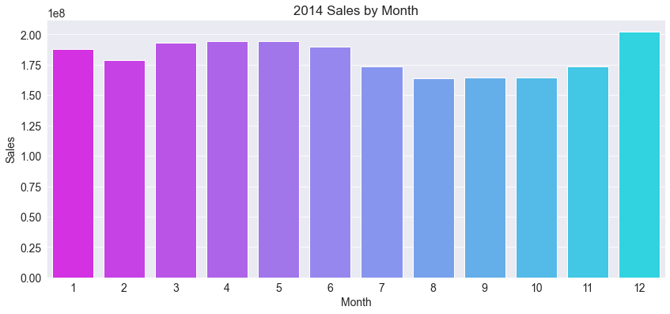
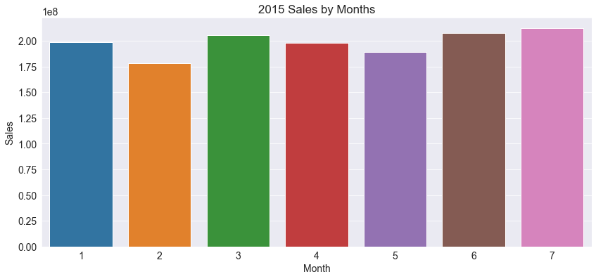
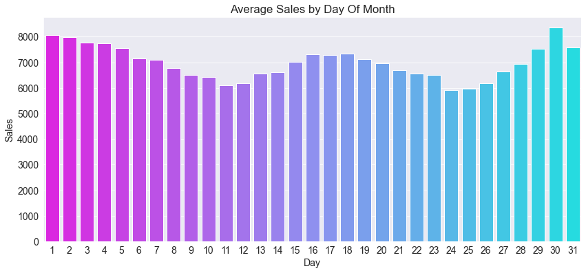

# REGRESSION: Predict a Retail Store Daily Sales

# rossmann-store-sales

## Overview

* **Dataset: 1 million rows from Kaggle competition**
* **Machine Learning Models** 
* **XGBoost Regressor**


## Visualization






















## Models Prediction

#### Model 1: rmse 1202.47

```
model1 = XGBRegressor(random_state=42, n_jobs=-1,n_estimators=1000, 
                      learning_rate=0.1, 
                      max_depth=10, 
                      subsample=0.5, 
                      colsample_bytree=0.5)

```


#### Model 2: rmse 1324.47

```
model2 = XGBRegressor(random_state=42, n_jobs=-1,n_estimators=1000, 
                      learning_rate=0.25, 
                      max_depth=12, 
                      subsample=0.7, 
                      colsample_bytree=0.7)
```

#### Model 3: rmse 1491.72 

```
model3 = XGBRegressor(random_state=42, n_jobs=-1,n_estimators=1000, 
                      learning_rate=0.5, 
                      max_depth=15, 
                      subsample=0.8, 
                      colsample_bytree=0.8)
```

#### Model 4: rmse 1656.49 

```
model4 = XGBRegressor(random_state=42, n_jobs=-1,n_estimators=1000, 
                      learning_rate=0.75, 
                      max_depth=20, 
                      subsample=0.9, 
                      colsample_bytree=0.9)
```

#### Model 5: rmse 1307.28

```
model5 = XGBRegressor(random_state=42, n_jobs=-1,n_estimators=1000, 
                      learning_rate=0.05, 
                      max_depth=10, 
                      subsample=0.3, 
                      colsample_bytree=0.3)
```
#### Model 6: rmse 1282.54

```
model6 = XGBRegressor(random_state=42, n_jobs=-1,n_estimators=1000, 
                      learning_rate=0.05, 
                      max_depth=10, 
                      subsample=0.4, 
                      colsample_bytree=0.4)
```

#### Model 7: rmse 1547.29

```
model7 = XGBRegressor(random_state=42, n_jobs=-1,n_estimators=1000, 
                      learning_rate=0.01, 
                      max_depth=10, 
                      subsample=0.5, 
                      colsample_bytree=0.5)
```

#### Model 8: rmse 1211.96

```
model8 = XGBRegressor(random_state=42, n_jobs=-1,n_estimators=1000, 
                      learning_rate=0.05, 
                      max_depth=10, 
                      subsample=0.5, 
                      colsample_bytree=0.5)
```

#### Model 9: rmse 1240.06

```
model9 = XGBRegressor(random_state=42, n_jobs=-1,
                      n_estimators=1000, 
                      learning_rate=0.2, 
                      max_depth=10, 
                      subsample=0.5, 
                      colsample_bytree=0.5)
```

#### Model 10: rmse 1226.53

```
model10 = XGBRegressor(random_state=42, n_jobs=-1,
                      n_estimators=1500, 
                      learning_rate=0.09, 
                      max_depth=10, 
                      subsample=0.5, 
                      colsample_bytree=0.5)
```
