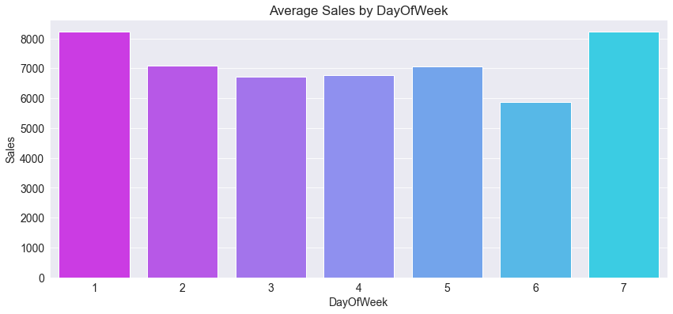

# REGRESSION: Predict a Retail Store Daily Sales

# rossmann-store-sales

## Overview

* **Dataset: 1 million rows from Kaggle competition**
* **Machine Learning Models** 
* **XGBoost Regressor**

## Visualization

